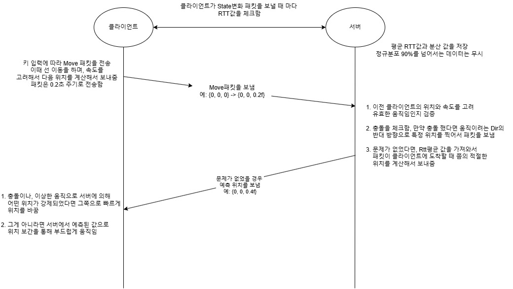
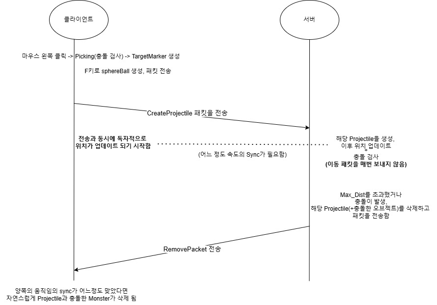

 

[간단한 영상](https://youtu.be/wvUPG6sIBE4)

 

 

**DirectX11 + IOCP 연동 습작 (제작중)**

IOCP서버 코드와 코드에 대한 대략적인 설명은 
[이전작업링크](https://github.com/homodeus-ms/IOCP-portfolio)&nbsp;이쪽을 봐주시기 바랍니다. 

현재까지 이동 동기화, 충돌 처리, Picking, 타겟팅, 공격등이 구현 되었습니다. 

서버 기술로는 IOCP, Job방식의 비동기처리, 메모리 풀링등이 사용 되었습니다. 
메인스레드가 게임 루프를 돌고 워커스레드들이 JobQueue의 일감들을 꺼내어 처리하는 방식입니다.  

Rendering과 충돌 처리를 원할히 위해서 Octree와 Frustum Culling, Instancing Render, Billboard 등이 사용되었습니다. 

 

 

---

 

**이동동기화**

WASD로 클라이언트에서 먼저 움직이고 서버에서 Valid 움직임 체크 후 클라이언트에게 다시 응답하는 방식입니다.

 

 

 

**<관련 클래스>**

 

**엔진**

Octree, BoundingCube 
[Octree folder](Engine/Octree/) 

**클라이언트**

Player, MyPlayer &nbsp; [ClientObject folder](Client/ClientObject/) 
DevApp1 &nbsp;[DevApp1 folder](Client/Main/) 

**서버**

GameRoom, MovePacketHandler, RttRecorder 
[Room folder](Server/Room) 

 

---

 

**<충돌 처리>**

 

1. 옥트리 서치(최소 큐브 크기, 혹은 재귀 Depth로 깊이 제한) 
2. 옥트리로 구현 했으나, 높이(y축)를 거의 사용하지 않는 다면 쿼드트리로 충분할 것 같습니다. 
3. 클라쪽과 서버 양쪽에서 모두 충돌 검사를 하고 있습니다.
   - 클라쪽에서 움직이려고 할 때 충돌 검사를 하고 충돌이 발생하면 아예 패킷을 보내지 않습니다.
   - 그렇지만 최종 검증은 서버에서 해야 된다고 생각했습니다. 
   - Picking의 반응 속도를 위해서라도 클라쪽에서도 충돌 처리가 필요하다고 생각했습니다.
4. 충돌 검사와 관련된 함수들은 Directx의 라이브러리를 사용했습니다. 

 

**예상치 못했던 이슈와 해결** 

1. 키보드를 빠르게 연타했을 때 캐릭터가 충돌체 내부로 조금씩 움직이면서 들어가는 현상이 있었습니다. 
    - 키보드를 아주 빠르게 한 번만 눌러도 조금씩 이동하게 되는 것이 문제였습니다. 
      키보드를 처음 눌렀을 때와 pressing상태를 구분해서 분리함으로써 해결했습니다. 

2. 충돌을 일부러 자주 일으켰을 때 카메라 위치의 어긋나는 것을 발견 했습니다. 
    - Camera의 위치 업데이트를 LateUpdate()에서 하게 함으로써 해결했습니다. 

 

**<관련 클래스>**

 

**엔진**

Octree, BoundingCube 
[Octree folder](Engine/Octree/) 
Scene.cpp의 Frustum culling, Render 부분 
[Scene.cpp, Update()](Engine/Scene/Scene.cpp#L37) 

**클라이언트**

DepApp1.cpp의 충돌 처리 부분
[DevApp1.cpp, CheckCollision()](Client/Main/DevApp1.cpp#L393) 
CharacterMoveScript 클래스 
[CharacterMoveScript의 Update()](Client/MoveScript/CharacterMoveScript.cpp#L30) 

**서버**

GameRoom.cpp 파일에 있습니다. 위 코드와 거의 같습니다. 

 

---

 

**공격**

현재 까지는 마우스 왼쪽 클릭으로 타켓팅 후, 타겟 마크가 사라지기전에 F키를 눌러서 SphereBall을 던지고 맞추는 것만 구현이 되어 있습니다. 
마우스 클릭 후 생기는 타겟 마크가 항상 카메라 쪽을 향해서 나타나게끔 Billboard 방식을 사용했습니다. 

 

 

 

**<관련 클래스>**

 

**클라이언트**

Picking 부분 &nbsp;[Picking](Client/ClientObject/MyPlayer.cpp#L235) 
UpdateSkill부분 &nbsp;[UpdateSkill](Client/ClientObject/MyPlayer.cpp#L60) 
 
Picking된 곳에 TargetMaker를 카메라쪽을 보게 회전하는 부분 
1. [SetTargetMarkOn()](Client/Main/DevApp1.cpp#L461) 
2. [GetLookCameraMatrix()](Client/Main/DevApp1.cpp#L506) 

**서버**

Projectile 생성 후 Update함수 [Update()](server/Object/Projectile.cpp#L7) 
Projectile 업데이트 때마다 충돌 검사 [CheckCollision](Server/Room/GameRoom.cpp#L585) 

 

 

 

감사합니다!

 

